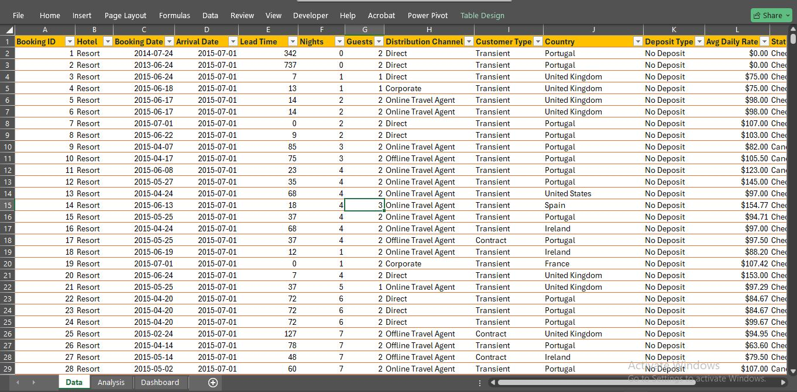
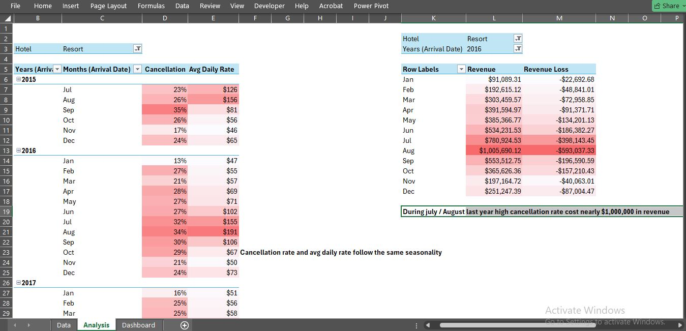

# HOTEL-BOOKINGS-CANCELLATION-AND-REVENUE-ANALYSIS.
An Explanatory Dashboard Analysis on the revenue Impact of Bookings Cancellations and  Why Overbooking is Necessary. 

---
## Project Overview 
This project examines booking and cancellation trends at our resort between **2015 and 2017**, with a particular focus on the high-demand summer months of **July and August**. The analysis explores how cancellation rates, average daily rates (ADR), and booking timelines influence both **revenue generation** and **revenue loss**.  

---
## Project Objective

This project analyses the relationship between bookings cancelled with revenue generated and revenue loss. 

---
## Data Dictionary
- The analysis was performed using a comprehensive dataset featuring booking details, guest demographics, distribution channels, and financial metrics etc.
 
| **Column Name**       | **Description**                                                                 | **Data Type**     | **Example of Data Type**   | **Values / Examples**                                                                 |
|------------------------|---------------------------------------------------------------------------------|-------------------|-----------------------------|---------------------------------------------------------------------------------------|
| Booking ID            | Unique identifier for each booking.                                             | Integer / String  | `Integer`                   | `10001`, `BKG_2345`                                                                   |
| Hotel                 | Type or name of the hotel within the Splendor Hotel Group.                      | String            | `Text`                      | `Resort Hotel`, `City Hotel`                                                          |
| Booking Date          | Date when the booking was made.                                                  | Date              | `YYYY-MM-DD`                | `2016-05-14`                                                                          |
| Arrival Date          | Date when guests are scheduled to arrive.                                        | Date              | `YYYY-MM-DD`                | `2016-07-01`                                                                          |
| Lead Time             | Number of days between the booking date and arrival date.                        | Integer           | `Numeric`                   | `34`, `120`                                                                           |
| Nights                | Number of nights the guests are booked to stay.                                  | Integer           | `Numeric`                   | `2`, `7`                                                                              |
| Guests                | Number of guests included in the booking.                                        | Integer           | `Numeric`                   | `1`, `4`                                                                              |
| Distribution Channel  | The channel through which the booking was made.                                  | String / Category | `Text`                      | `Direct`, `Online TA`, `Offline TA`, `Corporate`                                      |
| Customer Type         | Type of customer making the booking.                                             | String / Category | `Text`                      | `Transient`, `Corporate`, `Group`, `Contract`                                         |
| Country               | Country of origin of the guests (ISO code or name).                              | String            | `Text` (ISO Alpha-3 code)   | `PRT`, `USA`, `NGA`                                                                   |
| Deposit Type          | Whether a deposit was made for the booking.                                      | String / Category | `Text`                      | `No Deposit`, `Non Refund`, `Refundable`                                              |
| Avg Daily Rate        | Average daily rate for the booking.                                              | Float (Decimal)   | `Numeric (2dp)`             | `120.50`, `199.99`                                                                    |
| Status                | Final status of the booking.                                                     | String / Category | `Text`                      | `Check-Out`, `Canceled`, `No-Show`                                                    |
| Status Update         | Date of the last status update for the booking.                                  | Date              | `YYYY-MM-DD`                | `2016-07-02`                                                                          |
| Canceled (0/1)        | Binary indicator of whether the booking was canceled.                            | Integer (0/1)     | `Numeric`                   | `0 = Not Canceled`, `1 = Canceled`                                                    |
| Revenue               | Revenue generated from the booking (if not canceled).                            | Float (Decimal)   | `Numeric (2dp)`             | `850.00`, `0.00`                                                                      |
| Revenue Loss          | Revenue lost if the booking was canceled (0 or negative value if not canceled).  | Float (Decimal)   | `Numeric (2dp)`             | `-500.00`, `0.00`                                                                     |

---
## Cleaned Dataset

#### Before diving into the analysis, we cleaned the data by:

- Checking and handling missing values.
- Verifying data types for each column.
- Removing duplicate records.

---
## Analysis and Calculations 

---
## Explanatory Dashboard 

---
## Insights 

---
## Conclusion 

---
## Recommendation 

---
## About Me 
